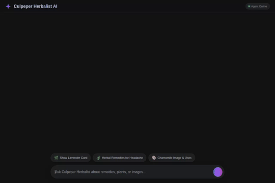

# Culpeper Herbalist Agent 🌿

A specialized, stateful AI herbalist and domain assistant grounded in Nicholas Culpeper's historic book *Culpeper's Complete Herbal* (1653). The agent provides authentic historical herbal remedies, medicinal plant virtues, domain inventory management, live weather and location lookups, and visual generation (images and videos) for domain items.



---

## Implemented Features & Capabilities

The following capabilities are fully wired up and implemented in code (`app/`):

- **Herbal Knowledge Base (Vertex AI RAG Corpus)**: Queries a Vertex AI RAG Corpus containing *Culpeper's Complete Herbal* (1653) to provide accurate historical plant virtues and remedies (`consult_herbal_corpus`).
- **Session Memory & Memory Bank**: Persists user allergies, dietary restrictions, and preferences across sessions using Google ADK Memory Bank (`PreloadMemoryTool` and `generate_memories_callback`).
- **Firestore Database Backend**: Manages domain inventory items with full CRUD support (`read_items`, `get_item_by_id`, `write_item`).
- **Botanical Image Generation**: Generates high-quality botanical illustrations using `gemini-3.1-flash-lite-image`, uploads them to Google Cloud Storage, and returns public HTTPS URLs (`generate_item_image`).
- **Botanical Video Generation**: Generates short botanical videos using `gemini-omni-flash-preview` in the `global` region, saves them as session artifacts, and uploads them to Google Cloud Storage (`generate_item_video`).
- **Geocoding & Location Tools**: Geocodes locations and searches nearby places using Google Maps APIs (`geocode_address`, `search_nearby_places`).
- **Live Weather & Air Quality Index**: Fetches real-time weather, temperature, humidity, wind, and US AQI using Open-Meteo APIs (`get_live_weather_and_aqi`).
- **Wikipedia Research**: Retrieves concise Wikipedia summaries for health conditions, herbs, and ingredients (`get_wikipedia_summary`).
- **Python Code Execution Sandbox**: Executes code safely in Vertex AI Agent Engine Sandbox (`AgentEngineSandboxCodeExecutor`).
- **A2UI v0.8 Card Rendering**: Renders structured UI surfaces (Cards, Columns, Rows, Text, Images) using the A2UI v0.8 Basic Catalog specification.

---

## Local Setup & Development

### Prerequisites
- Python 3.11+
- Node.js 18+ (for frontend dependencies & recording scripts)
- `agents-cli` installed
- Google Cloud SDK (`gcloud`) authenticated with Google Cloud Platform

### Environment Variables
Set the following environment variables or configure them in `deployment_metadata.json` / `agents-cli-manifest.yaml`:

```bash
export GOOGLE_CLOUD_PROJECT="<your-gcp-project-id>"
export GOOGLE_CLOUD_LOCATION="us-east1"
export GOOGLE_MAPS_API_KEY="<your-google-maps-api-key>"
```

### 1. Install Dependencies

```bash
# Install Python dependencies using uv
uv sync
```

### 2. Run the Agent Locally

Run the agent locally using the Agent Development Kit (ADK) developer UI:

```bash
agents-cli run --app app
```

### 3. Run the Custom FastAPI Frontend

Navigate to the `frontend/` directory, install frontend dependencies, and start the proxy server:

```bash
cd frontend
pip install -r requirements.txt
python main.py
```

---

## Deployment Instructions

### Deploy Agent to Vertex AI Agent Platform

To deploy or update the agent on Vertex AI Reasoning Engine / Agent Runtime:

```bash
agents-cli deploy --no-confirm-project
```

### Deploy Frontend to Google Cloud Run

To build and deploy the FastAPI chat UI to Google Cloud Run:

```bash
gcloud run deploy simple-test-agent-frontend \
  --source ./frontend \
  --region us-east1 \
  --allow-unauthenticated \
  --set-env-vars "AGENT_ENGINE_RESOURCE_NAME=<your-agent-engine-resource-name>,AGENT_DIRECTORY=app"
```

---

## Project Structure

```
.
├── app/
│   ├── agent.py              # Main ADK Agent & A2UI prompt definition
│   ├── rag_tools.py          # Vertex AI RAG Corpus retrieval tool
│   ├── firestore_tools.py    # Firestore inventory management tools
│   ├── image_tools.py        # Gemini image generation & Cloud Storage tool
│   ├── video_tools.py        # Gemini Omni video generation tool
│   ├── maps_tools.py         # Geocoding & Google Places tools
│   └── a2ui_utils.py         # A2UI callback transformer
├── frontend/
│   ├── main.py               # FastAPI proxy server & A2A parser
│   ├── Dockerfile            # Container build specification for Cloud Run
│   └── static/
│       └── index.html        # Modern Gemini-inspired A2UI chat interface
├── agents-cli-manifest.yaml  # Agent manifest configuration
├── demo.gif                  # Recorded demo animation
└── README.md
```
